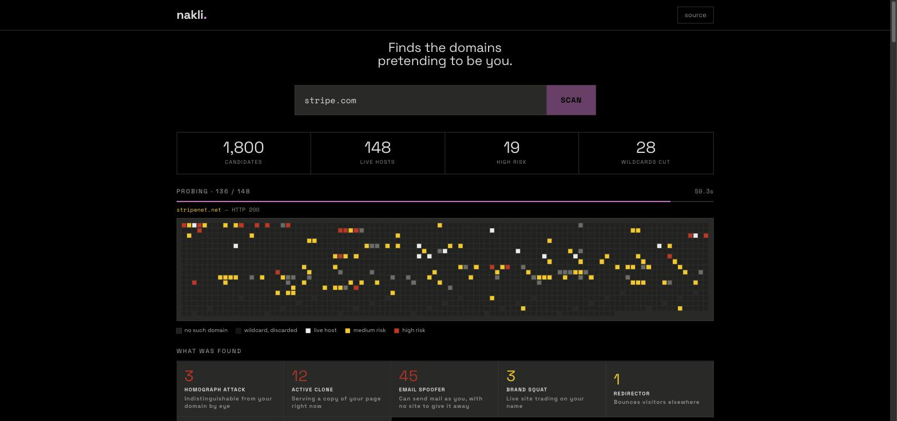
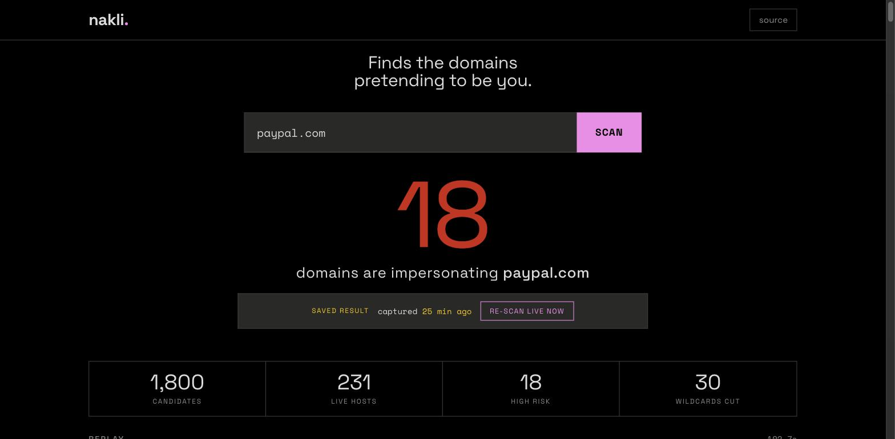
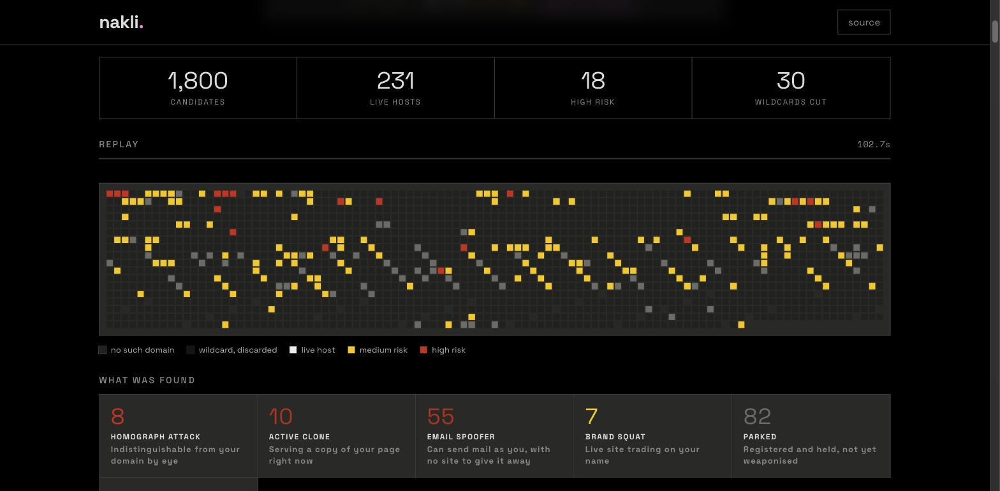
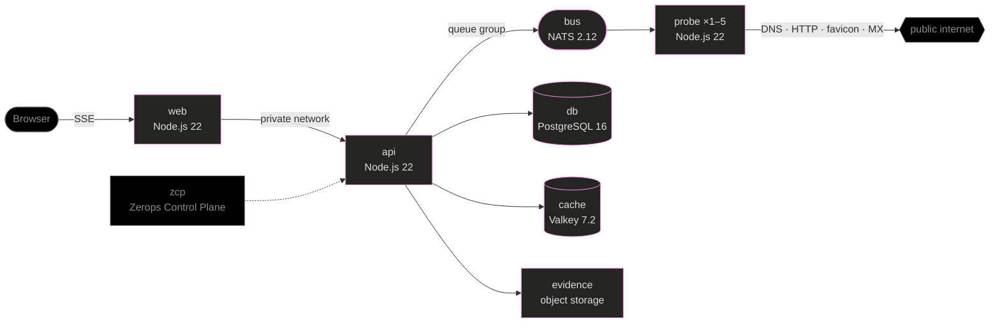

# nakli

> **nakli** (नकली) — Hindi for *counterfeit*.

**Type your brand. In seconds, see every lookalike domain that exists right now — ranked, with evidence.**

| | |
|---|---|
| **Live app** | https://web-2ca4-3000.prg1.zerops.app |
| **API** | https://api-2ca4-3000.prg1.zerops.app |
| **Example result** | [`paypal.com` — 18 high risk, replays the full grid](https://web-2ca4-3000.prg1.zerops.app/?scan=3f777bf1-eb91-4465-b53d-25cd3ba22614) |

No sign-up. Type a brand, or click one of the examples.



*A scan in progress. Every square is one real DNS lookup — 1,800 of them — and the
breakdown fills in as findings land. `stripe.com`: **12 domains serving a copy of
Stripe's page**, 45 able to send mail as Stripe, 3 visually indistinguishable from it.*

---

## Real results

All live at time of writing — scan any of them yourself:

| Brand | Found |
|---|---|
| `paypal.com` | **18 high-risk** — `paypal-secure.net`, `paypal-support.net`, `paypal.net`, all serving PayPal's exact page |
| `stripe.com` | **13 high-risk** — `support-stripe.com`, `update-stripe.com`, `stripe-account.com` |
| `twitch.tv` | **55 high-risk** |
| `netflix.com` | **18 high-risk** — `netflix.org` and `netflix.xyz` both score 100 |

## The problem

Brand-impersonation phishing starts with a domain: `paypal-secure.net`, `support-stripe.com`,
`hdfc-bank.co`. Most brands find out when a customer has already been robbed.

The data needed to find these first is public — DNS, HTTP, MX records, favicons — but nobody
correlates it on demand for an arbitrary brand. Existing tools are either offline CLIs
(dnstwist) or enterprise platforms. Nothing gives you an instant, evidence-backed answer from
a browser, for free.

## How it works

```
brand: "paypal.com"
  ↓  permutation engine     homoglyph · typo · bitsquat · TLD-swap · combosquat
  ↓  1,800 candidates       emitted in PRIORITY TIERS, not alphabetically
  ↓  wildcard calibration   discard TLDs whose registry answers everything
  ↓  DNS (2 passes)         Valkey cache first; unknown failures retried separately
  ↓  NATS fan-out           → probe workers, 1..5 containers
  ↓  per host               HTTP · favicon hash · title/content similarity · MX
  ↓  score → classify       "credential harvester", not just "97"
  ↓  archive                the page as we saw it, to object storage
```





*`paypal.com`: 1,800 candidates, 231 live hosts, 18 high risk — and 8 domains a
human eye cannot tell apart from the real one.*

**The funnel is the trick.** 1,800 candidates collapse to ~250 live hosts, so the expensive
HTTP work only touches ~14% of the set. That is what keeps a scan usable.

### What makes a finding

Score is additive and every point carries a reason. Two weights are deliberately
counter-intuitive:

- **MX is weighted low (12).** Parked domains routinely carry a catch-all MX, so alone it is
  weak evidence of intent.
- **An identical favicon is weighted high (30).** Very hard to hit by accident; it usually
  means a cloned front end.
- **A visually identical domain adds 25.** No user can catch a Cyrillic `а` by reading, so it
  outranks a typo they could.

Then the finding is **classified**, because a score tells you something is wrong but not what
kind of wrong: `homograph-attack`, `credential-harvester`, `active-clone`, `email-spoofer`,
`redirector`, `brand-squat`, `parked`, `dormant`.

### Homograph detection

`pаypal.com` with a Cyrillic `а` renders identically to `paypal.com` in every browser. nakli
flags the character, names its script, and shows the punycode — `xn--pypal-4ve.com` — which is
the only form where the deception is visible.

## Architecture on Zerops



All eight services do real work.

| Service | Type | Job |
|---|---|---|
| `web` | Node.js | UI + same-origin proxy to `api` over the private network |
| `api` | Node.js | Scan orchestration, background jobs, SSE streaming |
| `probe` | Node.js ×1–5 | NATS queue-group worker: HTTP, favicon, MX |
| `bus` | NATS | Fan-out; each request lands on exactly one worker |
| `db` | PostgreSQL | Scans + findings; shareable permalinks |
| `cache` | Valkey | DNS memo + wildcard table |
| `evidence` | Object storage | Archived pages, captured at scan time |
| `zcp` | Zerops Control Plane | Claude Code authorised in-project |

### Why this cannot run on serverless

A scan takes 30–120 seconds and needs hundreds of concurrent outbound probes, a long-lived
SSE connection streaming partial results, and background workers consuming a queue. Function
timeouts and cold starts break all three. The honest answer to *"why not Vercel"* is **it
would not run.**

Two things the platform forced, both load-bearing:

- **The Zerops L7 balancer returns 504 at exactly 60s.** A blocking request could never be the
  public interface, so scans run as background jobs and results stream over SSE.
- **Probe workers scale horizontally** because scan load is bursty and per-host independent.
  On a `netflix.com` scan, **87 of 103 hosts were probed by workers** and 16 fell back
  in-process when workers hit their concurrency ceiling.

## What I learned

Every one of these was found by measuring, not by reading the code. Each has a number
attached, and each contradicted what the code assumed.

| | |
|---|---|
| **More concurrency was worse — twice** | DNS at 200-wide found **0** high-risk and missed a byte-identical clone. HTTP at 150 was **8× faster and dropped findings 17 → 2** |
| **A socket leak cost 45× throughput** | One HTTP stage took **724 seconds**; ~16s after aborting the losing request |
| **Alphabetical sorting hid the best findings** | `slice(0, limit)` after a sort cut the highest-scoring domain because 'h' sorts late |
| **Wildcard DNS makes a scanner lie** | First run reported **169 domains that did not exist** |
| **A tighter timeout was a correctness bug** | Shaving the HTTP timeout took a scan from **8 high-risk to 1** |
| **Persistence must store derived fields** | Restored scans mislabelled every finding as "Dormant" |
| **Rendering per event froze the browser** | 231 findings → 231 full list rebuilds, ~250k DOM elements |

<details>
<summary><b>The detail behind each</b></summary>

**Concurrency, twice.** Pushing DNS to 200-wide found *zero* high-risk domains and missed
`hdfcbank.net` — a byte-identical clone — entirely. Public resolvers silently drop answers
when hammered, and a dropped answer is indistinguishable from "no such domain" unless you
check the error code. At 80-wide, with NXDOMAIN and timeouts treated differently, the same
scan found it at score 97. Later, raising HTTP concurrency to 150 cut that stage from 85s to
10.5s and dropped high-risk findings from 17 to 2 — a brand's lookalikes share one CDN, and
150 parallel connections read as an attack.

**The socket leak.** `fetchProfile` raced https against http with `Promise.any` and never
cancelled the loser. An undici response whose body is never read holds its socket, so leaked
losers exhausted the connection pool: one scan spent 724 seconds in the HTTP stage, versus
~16s once the losers were aborted.

**Priority tiers.** Candidates were sorted alphabetically before slicing to the limit, which
cut `hdfcbank.net` purely because 'h' sorts late. They are now emitted in tiers — exact brand
on other TLDs first, then combosquats, then variants — so the limit trims the tail, never the
head.

**Wildcard calibration.** Some registries resolve every name. The first local run reported 169
domains that did not exist. Two random probes per TLD now calibrate this away.

**Baseline timeouts.** Cutting the HTTP timeout to save wall-clock took `hdfcbank.com` from 8
high-risk to 1: the real bank is slower than the squatters copying it, and with no baseline
title every similarity score collapses to zero. The baseline now gets its own patient
dispatcher and three retries — and if it still fails, the UI says so rather than reporting a
confident, empty result.

**Derived fields.** `threat`, `homograph` and `evidenceKey` had no columns, so a restored scan
ran the classifier's default and labelled active clones as "Dormant".

**Render throttling.** `render()` rebuilds the findings list with `innerHTML` and ran on every
finding event — 231 rebuilds of a growing list, each with a 9-row evidence table per row. The
tab locked up exactly when results landed. Renders are now coalesced to one per 400ms.

</details>

## Local development

```bash
git clone https://github.com/vaibhav-kakde-in/nakli.git
cd nakli && npm install

# validate the idea with no infrastructure at all
uv run tools/phishscan.py paypal.com

# run the UI locally against the deployed backend (needs `zcli vpn up`)
API_URL=http://api.zerops:3000 PORT=8099 node web/server.js
```

`tools/phishscan.py` is the original single-file proof of concept. The idea was validated
there — 4,000 candidates, 16 seconds — before any infrastructure was written.

## AI disclosure

Built with **Claude Code**, running against the Zerops project with **ZCP** authorised.
(`AGENTS.md` and `CLAUDE.md` in this repo were generated by ZCP itself.)

AI wrote most of the code, the permutation tables, the UI, and this README. What was mine:
the architecture, the scoping decisions, and every judgement call listed under *What I learned* —
each of those was a measurement that contradicted what the code assumed, including several the
AI's first pass got wrong and defended. The local proof of concept in `tools/phishscan.py`
exists because I wanted the idea validated before committing to infrastructure.

The commit history is the honest record: it contains the failures, the reverts, and the
reasons.

## Ethics

Read-only fetches of publicly served pages, rate limited — the same behaviour as dnstwist and
urlscan.io. No exploitation, no credential interaction, no automated reporting or takedown.
Archived pages are stamped as captures and are never re-served as live content.

**Findings are candidates for human review, not verdicts.** A domain scoring 97 may be a
brand's own defensive registration. The tool surfaces evidence; a person decides.

---

Built for [The Zerops Challenge](https://www.wemakedevs.org/hackathons/zerops), August 2026.
